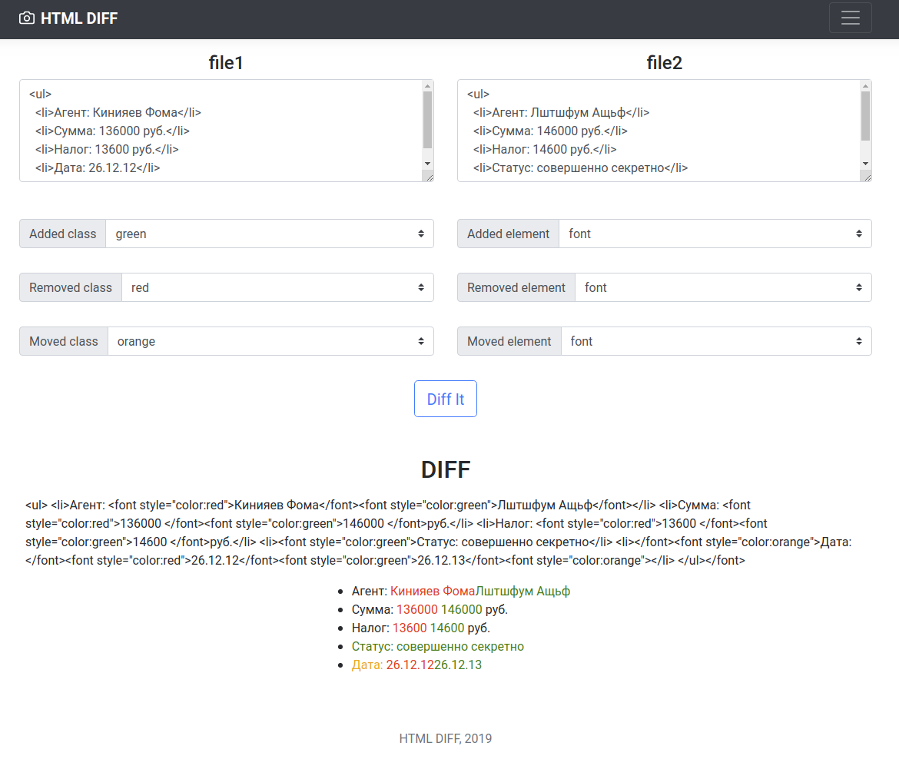

# 35_diff_service

HTML DIFF service based on [this script](https://github.com/aaronsw/htmldiff).


# How to Install

Python 3 and libraries from **requirements.txt** should be installed. Use virtual environment tool, for example **virtualenv**.

```bash

virtualenv virtualenv_folder_name
source virtualenv_folder_name/bin/activate
python3.6 -m pip install -r requirements.txt
```

Put host, port, debug mode to .env file.

```bash
HOST=127.0.0.1
PORT=5000
FLASK_DEBUG=TRUE
```


# Quickstart

Run **server.py**.

```bash

$ python server.py

 * Running on http://127.0.0.1:5000/ (Press CTRL+C to quit)
 * Restarting with inotify reloader
 * Debugger is active!

```

Goto [http://127.0.0.1:5000/ ](http://127.0.0.1:5000/ ) and test service with your html samples.




# Project Goals

The code is written for educational purposes. Training course for web-developers - [DEVMAN.org](https://devman.org)
